# Load Time Series Forecasting Model

#### Author: James Alikhani    
<alikhani.james@gmail.com>   
January 2019


```python
import pandas as pd
import numpy as np
import datetime as dt
import matplotlib.pyplot as plt
import pmdarima as pm
import holidays
import copy
import itertools
import pylab
import seaborn as sns
import scipy.stats as sstat
from statsmodels.tsa.seasonal import seasonal_decompose
from statsmodels.tsa.holtwinters import ExponentialSmoothing
from statsmodels.tsa.statespace.sarimax import SARIMAX 
import statsmodels.api as sm
import statsmodels
import warnings
warnings.filterwarnings("ignore")
%matplotlib inline
plt.style.use('bmh')
us_holidays = holidays.UnitedStates()
```


```python
plt.rcParams['figure.figsize'] = 30, 6 
plt.rcParams["axes.titlesize"]  = 24
plt.rcParams["axes.labelsize"]  = 18
#plt.rcParams["lines.linewidth"]  = 3
#plt.rcParams["lines.markersize"] = 10
#plt.rcParams["xtick.labelsize"] = 16
#plt.rcParams["ytick.labelsize"] = 16
#plt.rcParams["legend.fontsize"] = 20
#plt.rcParams["legend.handlelength"] = 2
```


```python
def loadData(fname, startDate, endDate, interval=0.25):  
    
    df = pd.read_csv(fname)    
    df.columns = ['indx','load','temp','date','time','dow','month']   
    
    # date and time columns    
    df.date = pd.to_datetime(df.date)
    df.time = pd.to_datetime(df.time)
    df.time = df.time.dt.hour + df.time.dt.minute/60
    df['t'] = df['date'].apply(lambda x: x.timetuple().tm_yday-1) + df['time']/24 # Julian time 
    
    # holidays, weekends, and work days
    df['holidays'] = df.date.apply(lambda x: int(x in us_holidays))    
    df['workDay'] = df.apply(lambda row: 0 if row['dow']>4 or row['holidays'] else 1, axis=1)
    
    # start and end date trim
    start = dt.datetime.strptime(startDate, '%Y-%m-%d') 
    end = dt.datetime.strptime(endDate, '%Y-%m-%d')
    df = df[(df.date>=start) & (df.date<end)]       
    
    # check for missing/duplicated records
    df['deltaT'] = df['time'].diff()-interval
    df.loc[df.deltaT==-24,'deltaT'] = 0
    
    if sum(df.deltaT[1:])!=0:
        print("WARNING: the dataset contains missing/duplicated records!")
        
    # missing value/duplicated scenarios may be differnet for different dataset    
    if len(df[df.deltaT<0]):  
        df = df.groupby(['date','time'], as_index=False).max()
        print("duplicated records are removed")
    
    # datetime index
    df['indx'] = df['indx'].astype(str).apply(lambda x: x[:-6])
    df['indx'] = pd.to_datetime(df['indx'])
    df.set_index('indx', inplace=True)
    
    
    if len(df[df.deltaT>0]):
        idx = pd.DatetimeIndex(freq='15T',start=startDate, end=endDate)[:-1]
        df = df.reindex(idx)
        df.loc[df.date.isnull(), 'date'] = pd.to_datetime([str(d.date()) for d in df[df.date.isnull()].index])   
        missing_time = pd.to_datetime([str(d.time()) for d in df[df.time.isnull()].index])
        df.loc[df.time.isnull(), 'time'] = [x.time().hour + x.time().minute/60 for x in missing_time]
        df.loc[df.month.isnull(), 'month'] = [x.month for x in df.loc[df.month.isnull(), 'date']]
        df['dow'].fillna(method='ffill', inplace=True)
        print("missing periods are added")
        
    df.drop(['deltaT'], axis=1, inplace=True)
    
    # linear interpolation for temperature and missing loads
    df.interpolate(method='linear', axis=0, inplace=True) # needs to be evaluated for longer than 1 hr intrvals
    
    # de-meaning temp
    meanTemp = round(df['temp'].mean(),1)
    df['dtemp'] = abs(df['temp'] - meanTemp) # for very low or very high temp effect: hottub effect 
    
    # log transform
    #df['logload'] = df.load.apply(lambda x: np.log(x+10))
    #df['logtemp'] = df.temp.apply(lambda x: np.log(x))
    
    # date to string
    df.date = df.date.apply(lambda x: str(x.date()))
    
    return df[['date', 'time', 't', 'workDay', 'load', 'temp', 'dtemp']], meanTemp
```


```python
def replaceAnomaly(df, anomalyDay='2013-08-17',
                   anomalyDayBefore=None,
                   anomalyDayAfter=None, 
                   replaceWithDay='2013-08-24'):  
    
    df.loc[df.date==anomalyDay, 'load'] = df[df.date==replaceWithDay]['load'].values
    
    if anomalyDayBefore is not None:
        load0 = df.loc[df.date==anomalyDay,'load'][0]
        df.loc[(df.date==anomalyDayBefore) & (df.time>12) & (df.load<load0), 'load'] = load0
    
    if anomalyDayAfter is not None:
        load1 = df.loc[df.date==anomalyDay,'load'][-1]
        df.loc[(df.date==anomalyDayAfter) & (df.time<12) & (df.load<load1), 'load'] = load1
    
```


```python
def RMSEeval(true,pred):
    return np.mean(abs(true-pred))
```


```python
class Forecaster:
    def __init__(self, method='HW', logTransformed=False,  
            regMethod="OLS", rho=1, fitIntercept=True,
            deseasonalize=False, degree=4, order=(1,0,0), seasonalOrder=(0,0,0,1)):        
        self.method = method
        self.logTransformed = logTransformed
        self.regMethod = regMethod
        self.rho = rho
        self.fitIntercept = fitIntercept 
        self.deseasonalize = deseasonalize
        self.degree = degree
        self.order = order
        self.seasonalOrder = seasonalOrder
    
    def modelGen(self):
        if self.method=='SARIMA' or self.method=='SARIMAX':
           self.model = SARIMAX(
               endog=self.y,
               order=self.order,
               seasonal_order=self.seasonalOrder,
               enforce_stationarity=False,
               enforce_invertibility=False)

        if self.method=='Holt-Winters' or self.method=='HW':
           self.model = ExponentialSmoothing(self.y, seasonal='add', 
                                             seasonal_periods=self.seasonalPeriod) 
       
    def fit(self, y, xgen=None, timeVector=None, seasonalPeriod=None): 
        self.y = y.copy()
        self.xgen = xgen
        self.timeVector = timeVector
        self.seasonalPeriod = seasonalPeriod

        if self.logTransformed:
            self.y = self.y.apply(lambda x: np.log(x))
        
        if self.xgen is not None:
            self.xgenReg()
            ygen = self.reg.predict(self.xgen)
            self.y -= ygen  #removes the xgen effect
            
            if self.logTransformed:
                self.cf = np.mean(np.exp(self.reg.resid)) # correction Factor for log transform
        
        if self.deseasonalize:
            self.seasonalCurve()
            ySeasonal = self.seasonalFit(self.timeVector)
            self.y -= ySeasonal  #removes seasonality
            
        self.modelGen()   
        self.fitModel = self.model.fit()
        
        # residuals and error metric
        self.yPred, _ = self.predict(start=y.index[0], end=y.index[-1], 
                                  xgenTest=xgen, timeVectorTest=timeVector)
        self.residuals = y - self.yPred
        
    def xgenReg(self):
        if self.fitIntercept:
            self.xgen = sm.add_constant(self.xgen)

        if self.regMethod=="OLS":
            self.reg = sm.OLS(self.y, self.xgen).fit()

        if self.regMethod=="GLS": #when residuals have significant autocorrelation
            self.reg = sm.GLSAR(self.y, self.xgen, rho=self.rho).iterative_fit(1) 
    
    def seasonalCurve(self):
        coefs = np.polyfit(self.timeVector, self.y, self.degree)
        self.seasonalFit = np.poly1d(coefs)
    
    def summary(self):
        self.resSTD = np.sqrt(np.mean(self.residuals**2))
        self.RMSE = np.sqrt(np.mean(self.residuals**2)) 
        self.standardResiduals = self.residuals / self.resSTD  # standardized residuals
        self.KSstat = sstat.kstest(self.standardResiduals, 'norm').pvalue
        
        print('Model: {}'.format(self.method))
        print('No. observation: {}'.format(len(self.residuals)))
        print('Error STD: {}'.format(round(self.resSTD,3)))
        print('KS stat p_value: {}'.format(round(self.KSstat,3)))
        print('RMSE: {}'.format(round(self.RMSE, 2)))
        
    def plotDiagnostics(self, figsize=(15, 12)):
        fig = plt.figure(figsize=figsize)

        ax1 = plt.subplot(2, 2, 1)
        self.standardResiduals.plot(ax=ax1)
        ax1.set_title("Standardized Residuals", fontsize=12)

        ax2 = plt.subplot(2, 2, 2)
        ax2 = self.standardResiduals.hist(density=True)
        pd.DataFrame(index=np.arange(-4, 4, 0.01), 
                     data=sstat.norm.pdf(np.arange(-4, 4, 0.01),0,1)).plot(ax=ax2)
        ax2.set(xlim=[-4,4])
        ax2.set_title("Histogram", fontsize=12)
        ax2.legend(['N(0,1)','hist'], loc=1, fontsize=10)

        ax3 = plt.subplot(2, 2, 3)
        sm.qqplot(self.standardResiduals, line='45', ax=ax3)
        ax3.set_title("Normal Q-Q", fontsize=12)
        ax3.set(xlabel='', ylabel='')

        ax4 = plt.subplot(2, 2, 4)
        statsmodels.graphics.tsaplots.plot_acf(self.standardResiduals, lags=100, ax=ax4)
        ax4.set_title("ACF Correlogram", fontsize=12)
        
    def predict(self, start, end, xgenTest=None, timeVectorTest=None, trueValues=None):
        if self.xgen is not None and xgenTest is None:
            print("error")
        
        pred = self.fitModel.predict(start=start, end=end)
        
        if self.xgen is not None:
            if self.fitIntercept: 
                xgenTest = sm.add_constant(xgenTest)                 
            pred += self.reg.predict(xgenTest)
        
        if self.deseasonalize:               
            pred += self.seasonalFit(timeVectorTest)
        
        if self.logTransformed:
            pred = np.exp(pred) * self.cf
        
        rmse = None
        if trueValues is not None:
            rmse = RMSEeval(trueValues, pred)
        
        return pred, rmse
```

### 1- Data loading, exploratory analysis, and outlier handling  
The `loadData()` function reads data, formats the data types, and handles the missing/duplicated records. It also checks for the holidays assuming that the data are recorded in the US. Finally, it combines weekends with holidays to distinguish the work days with weekends/holidays.


```python
df, meanTemp = loadData(fname="../inputs/equity_RN628A_hbase_data.csv", 
                        startDate='2012-11-03', endDate='2013-12-01')
```

    WARNING: the dataset contains missing/duplicated records!
    duplicated records are removed
    missing periods are added
    


```python
df.head()
```


<div>
<style scoped>
    .dataframe tbody tr th:only-of-type {
        vertical-align: middle;
    }

    .dataframe tbody tr th {
        vertical-align: top;
    }

    .dataframe thead th {
        text-align: right;
    }
</style>
<table border="1" class="dataframe">
  <thead>
    <tr style="text-align: right;">
      <th></th>
      <th>date</th>
      <th>time</th>
      <th>t</th>
      <th>workDay</th>
      <th>load</th>
      <th>temp</th>
      <th>dtemp</th>
    </tr>
  </thead>
  <tbody>
    <tr>
      <th>2012-11-03 00:00:00</th>
      <td>2012-11-03</td>
      <td>0.00</td>
      <td>307.000000</td>
      <td>0.0</td>
      <td>51.0</td>
      <td>54.0</td>
      <td>3.0</td>
    </tr>
    <tr>
      <th>2012-11-03 00:15:00</th>
      <td>2012-11-03</td>
      <td>0.25</td>
      <td>307.010417</td>
      <td>0.0</td>
      <td>51.0</td>
      <td>54.0</td>
      <td>3.0</td>
    </tr>
    <tr>
      <th>2012-11-03 00:30:00</th>
      <td>2012-11-03</td>
      <td>0.50</td>
      <td>307.020833</td>
      <td>0.0</td>
      <td>50.4</td>
      <td>54.0</td>
      <td>3.0</td>
    </tr>
    <tr>
      <th>2012-11-03 00:45:00</th>
      <td>2012-11-03</td>
      <td>0.75</td>
      <td>307.031250</td>
      <td>0.0</td>
      <td>50.1</td>
      <td>54.0</td>
      <td>3.0</td>
    </tr>
    <tr>
      <th>2012-11-03 01:00:00</th>
      <td>2012-11-03</td>
      <td>1.00</td>
      <td>307.041667</td>
      <td>0.0</td>
      <td>45.3</td>
      <td>54.0</td>
      <td>3.0</td>
    </tr>
  </tbody>
</table>
</div>


#### Outlier detection 


```python
ax = df.loc[::4, ['load']].plot()
ax.set_title("Load - 1 year")
ax.set_ylabel("Load (kwh)")
```


    Text(0,0.5,'Load (kwh)')


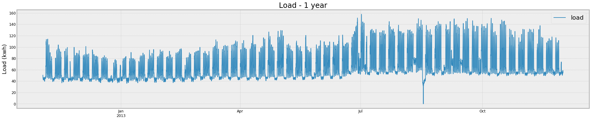


```python
ax1 = df.loc[::4, ['load']][6500:7500].plot(title="Load and Temp - anomaly days", label='load')
ax2 = ax1.twinx()
ax2.spines['right'].set_position(('axes', 1.0))
ax2.set_ylim([0,140])
ax1.set_ylabel("Load (kwh)")
ax2.set_ylabel("Temp (F)")
df.loc[::4, ['temp']][6500:7500].plot(ax=ax2, color='green', label='temp')
```


    <matplotlib.axes._subplots.AxesSubplot at 0x1c5c6fc470>


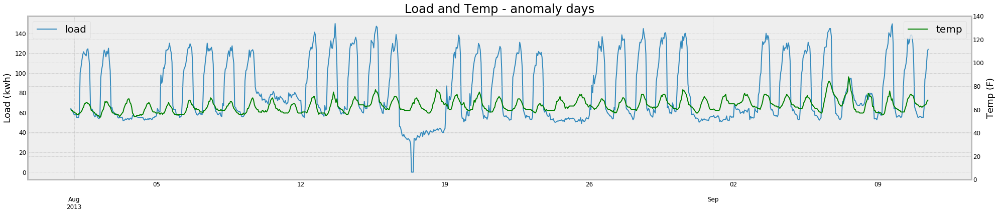


The load variation pattern in days of August 17th and 18th 2013 is completely different than the entire trend and magnitude of the time series. This indicates an anomaly due to probably a special event like a partial/full shutdown in the power plant. Essentially outliers can be "overcome", i.e. accommodated by identifying them and then incorporating dummy predictor series to provide the adjustment. Since we didn't see any other event like this, it is hard (and almost impossible) for the time series models to capture this type of events. It is also not useful to keep this anomaly if the goal is to forecast the load, because it can significantly skew the model coefficients. There are three ways to handle this anomaly:   

1- to keep it as it is,    
2- to replace it with a similar day like last or next week same days if the temperature does not show a significant change, and,      
3- to estimate the loads with a model fitted on the time series up to the starting date/time of that anomaly.

while all three scenarios may add a little bit uncertainty to the model fitting results, I followed the second option to replace the entire anomaly loads on August 17th and 18th with the following week August 24th and 25th, respectively. The function `replaceAnomaly()` does this replacement. Note that the temperature in both weekends is in the same range. 


```python
replaceAnomaly(df, anomalyDay='2013-08-17', anomalyDayBefore='2013-08-16', replaceWithDay='2013-08-24')
```


```python
replaceAnomaly(df, anomalyDay='2013-08-18', anomalyDayAfter='2013-08-19', replaceWithDay='2013-08-25')
```


```python
ax1 = df.loc[::4, ['load']][6500:7500].plot(title="Loading and Temp - anomaly is removed!", 
                                            figsize=(30, 6), label='load')
ax2 = ax1.twinx()
ax2.spines['right'].set_position(('axes', 1.0))
ax2.set_ylim([0,140])
ax1.set_ylabel("Load (kwh)", fontsize=18)
ax2.set_ylabel("Temp (F)", fontsize=18)
df.loc[::4, ['temp']][6500:7500].plot(ax=ax2, color='green', label='temp')
```


    <matplotlib.axes._subplots.AxesSubplot at 0x1c60f3f390>


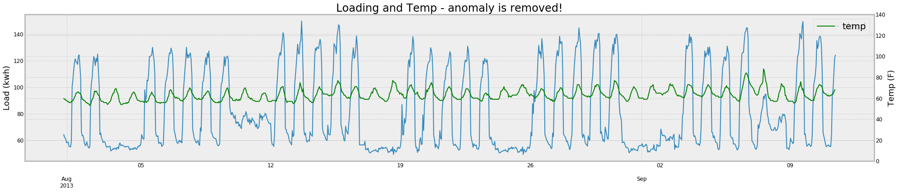


### 2- Seasonality and pattern detection
In this section we plot the temp and load data to see any distinguishable patterns in the time series.
#### 2-1- Temperature


```python
ax = df.loc[::4, ['temp']].plot(color="red")
ax.set(ylabel="Temp (F)", title="Temperature - 1 year")
```


    [Text(0,0.5,'Temp (F)'), Text(0.5,1,'Temperature - 1 year')]


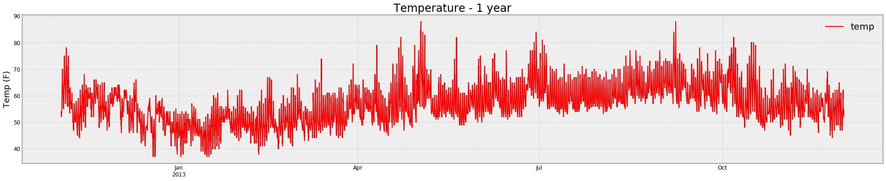


```python
result = seasonal_decompose(df.loc[::4, ['temp']][:500], model='add')
fig = result.plot()
```


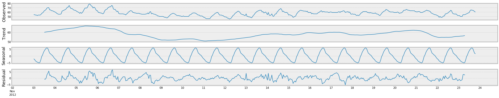


A clear yearly sinusoidal seasonality exists in the temperature time series. But since the period of time series is only slightly longer than a year, it is not possible for the time series models to capture this seasonality. Therefore, a 4th-degree polynomial curve is fitted to the temperature to find and extract the annual seasonality from the temperature.


```python
degree = 4  # 4th degree polynomial is a very close approximation of the sinusoidal curve
tempYearlyCoefs = np.polyfit(df.t, df.temp, degree)
tempYearlyFit = np.poly1d(tempYearlyCoefs)
seasonalTemp = tempYearlyFit(df.t)
```


```python
ax1 = df.loc[::4, ['temp']].plot(color="red")
ax1.set(ylabel="Temp (F)", title="Temperature: yearly seasonality",)
pd.DataFrame({'seasonalTemp':seasonalTemp}, index=df.index).plot(color='black', linewidth=3, ax=ax1)
```


    <matplotlib.axes._subplots.AxesSubplot at 0x1c69855b00>


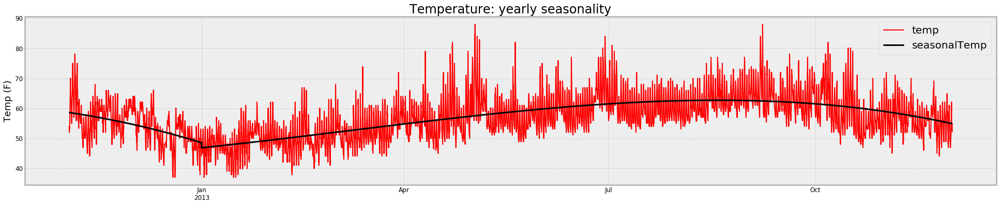


After fitting a polynomial to this seasonal trend, we deseasonalize (yearly) the temperature and we perform the time series analysis and forecasting on the deseasonalized temperature.


```python
tempDeseason = df.temp - seasonalTemp
```

The (partial) corelogram on multiple lags can be created to detect the underlying auto-correlation and seasonality. 


```python
pm.utils.plot_acf(tempDeseason[::4], show=True, lags = 250,
                  title="Temperature Autocorrelation - 10 days lags")
```


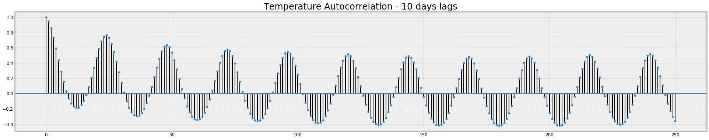


```python
pm.utils.plot_pacf(tempDeseason[::4], show=True, lags = 250, 
                   title="Temperature Parcial Autocorrelation - 10 days lags")
```


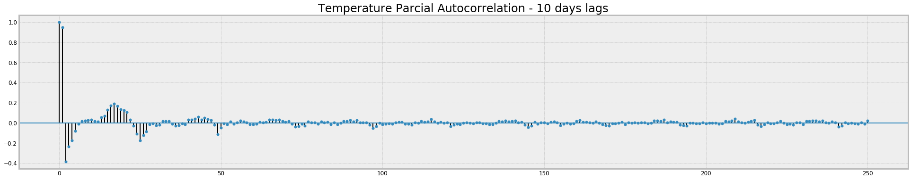


Visual investigation of the ACF and PACF show a clear daily (24-hour) seasonality in the annually deseasonalized temperature. However, since there are enough data (more than 400 days), the model should be able to capture the 24-hour lag correlation for the temperature variations. The first lag of the PACF with a value close to 1 also indicates a very strong first order autoregression, aka AR(1). 

#### 2-2- Load


```python
ax1 = df.loc[::4, ['load']].plot()
ax1.set(ylabel = "Load (kwh)", title="Load - 1 year")
```


    [Text(0,0.5,'Load (kwh)'), Text(0.5,1,'Load - 1 year')]


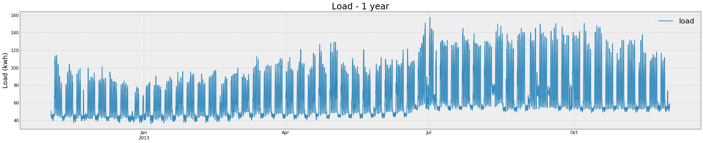


```python
ax1 = df.loc[::4, ['load']][:2000].plot(label='load')
ax2 = ax1.twinx()
df.loc[::4, ['workDay']][:2000].plot(ax=ax2, color='green', label='temp', linewidth=5)
ax2.spines['right'].set_position(('axes', 1.0))
ax2.set(yticks=[0,1], yticklabels=['weekend/holiday','work day'])
ax1.set(ylabel="Load (kwh)", title="Load - weekend/holiday effect")
```


    [Text(0,0.5,'Load (kwh)'), Text(0.5,1,'Load - weekend/holiday effect')]


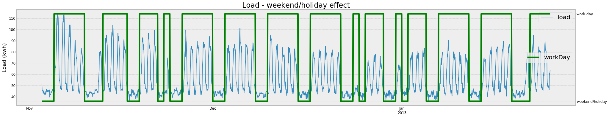


```python
ax1 = df.loc[::4, ['load']][1050:1150].plot()
ax1.set(ylabel="Load (kwh)", title="Load - daily pattern",)
```


    [Text(0,0.5,'Load (kwh)'), Text(0.5,1,'Load - daily pattern')]


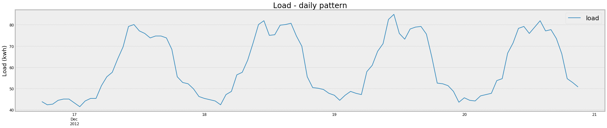


Electric load typically exhibits intra-daily seasonality, as well as intra-weekly seasonality (weekends have different power demand patterns than weekdays), plus yearly seasonality (high power demands for heating in winter, higher power demands for cooling in summer). Plus time-shifting holidays.

Similar to temperature, there may be a yearly seasonality (and trend) in the load data as well, nevertheless, the time series time period is not wide enough to capture and treat these trends. It can be seen that the entire load are increased after June that is probably due to the increase in the temperature. We are going to remove the load-temperature dependency later and that's why we are not concern about the yearly seasonality of load due to the temperature change. However, still there has to be at least 2 (and better to be up to 5) years of load data to detect the long-term seasonality and trend.

#### 2-3- Checking the load-temperature correlation 

First we calculates and plot the heat map of correlation between load and other attributes in the dataset. This helps to detect any strong linearity and to find the exogenous variables. 


```python
Var_Corr = df.corr()
fig, ax = plt.subplots(figsize=(8,6))
sns.heatmap(Var_Corr, xticklabels=Var_Corr.columns, yticklabels=Var_Corr.columns, annot=True, ax=ax)
```


    <matplotlib.axes._subplots.AxesSubplot at 0x1c64fb6c18>


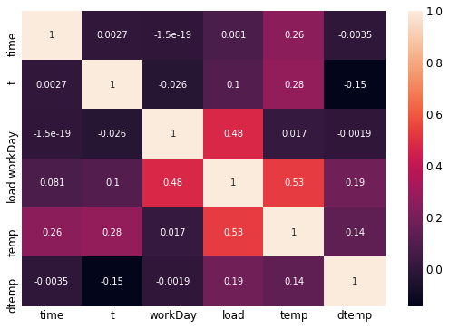


A moderately strong (positive) correlation exkists between the load/temperature and load/workdays. The correlation for `dtemp`$=abs(temp-\bar{temp})$, is not as strong as expected mainly because this particular dataset seems to be recorded in a hot region. 

##### 2-3-1- exogenous variables for load

The households electricity loads are higher in both cold and hot season due to more heating/cooling that is known as the "bathtub effect". Therefore, the absolute temperature deviations from its yearly average (as `dtemp` columns in the df) is used here to take into consideration this effect. This effect is more significant in the region with higher winter/summer temperature change, like NY city. According to the correlation heat map, temperature and workday are also considered as exogenous variables. A linear regression is going to fit to the load and the exogenous variables to remove their effects.


```python
X, y = df[['temp','dtemp','workDay']], df.load
```


```python
X = sm.add_constant(X)
```


```python
est = sm.OLS(y, X).fit()
print(est.summary())
```

                                OLS Regression Results                            
    ==============================================================================
    Dep. Variable:                   load   R-squared:                       0.516
    Model:                            OLS   Adj. R-squared:                  0.516
    Method:                 Least Squares   F-statistic:                 1.342e+04
    Date:                Fri, 18 Jan 2019   Prob (F-statistic):               0.00
    Time:                        18:32:26   Log-Likelihood:            -1.6227e+05
    No. Observations:               37728   AIC:                         3.245e+05
    Df Residuals:                   37724   BIC:                         3.246e+05
    Df Model:                           3                                         
    Covariance Type:            nonrobust                                         
    ==============================================================================
                     coef    std err          t      P>|t|      [0.025      0.975]
    ------------------------------------------------------------------------------
    const        -55.5439      0.736    -75.434      0.000     -56.987     -54.101
    temp           1.7898      0.013    140.293      0.000       1.765       1.815
    dtemp          0.6830      0.021     32.505      0.000       0.642       0.724
    workDay       25.8958      0.197    131.209      0.000      25.509      26.283
    ==============================================================================
    Omnibus:                      437.834   Durbin-Watson:                   0.064
    Prob(Omnibus):                  0.000   Jarque-Bera (JB):              309.351
    Skew:                           0.111   Prob(JB):                     6.69e-68
    Kurtosis:                       2.616   Cond. No.                         463.
    ==============================================================================
    
    Warnings:
    [1] Standard Errors assume that the covariance matrix of the errors is correctly specified.
    


```python
loadReg = est.predict(X)
```


```python
loadDeregressed = pd.DataFrame({'loadDeregressed':df.load - loadReg})
```


```python
ax1 = df.loc[::4, ['load']][800:1200].plot(color="blue")
pd.DataFrame({'loadReg':loadReg}, index=df.index).loc[::4,][800:1200].plot(color='black', ax=ax1)
loadDeregressed.loc[::4,][800:1200].plot(color='green', ax=ax1)

ax1.set(ylabel="Load (kwh)", title="Load: measured and xgen modeled")
```


    [Text(0,0.5,'Load (kwh)'), Text(0.5,1,'Load: measured and xgen modeled')]


De-regression helped to reduce the effect of weekend/holidays. 


```python
pm.utils.plot_acf(loadDeregressed[::4], show=True, lags = 250,
                  title="Load (Deregressed) Autocorrelation - 10 days lags")
```


```python
pm.utils.plot_pacf(loadDeregressed[::4], show=True, lags = 250,
                  title="Load (Deregressed) Parcial Autocorrelation - 10 days lags")
```


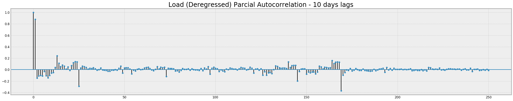


Investigting the PACF shows a strong daily (lag at 24) and weekly (lag at 168) seasonal patterns. There is also a strong first lag auto-correlation suggesting AR(1). 

### 3- Model selection, deseasonalizing, and training 

The 15-min interval made it computationally expensive for my persoanl computer to perform the training over the entire timeseries, especially for the high-order SARIMA models. I am showing the models for 1-our interval but the procedure is exacty the same for the 15-min and any other intervals. 

In the `Forecaster` class, the user can indicate eithe Holt-Winters (HW) or SARIMA models with a proper parameters. 


```python
train, test = df.iloc[:(24*7*4*20):1, ], df.iloc[(24*4*7*20):(24*4*7*21):1,]  # with 15-min interval
```


```python
train, test = df.iloc[:(24*7*4*20):4, ], df.iloc[(24*4*7*20):(24*4*7*21):4,] # with 1-hr interval
```

#### 3-1- Temperature
##### 3-1-1- Holt-Winters Model


```python
clfTemp = Forecaster(method='HW', deseasonalize=True, degree=4)
```


```python
clfTemp.fit(y=train['temp'], timeVector=train.t, seasonalPeriod=24) # with daily seasonality
```


```python
clfTemp.summary()
```

    Model: HW
    No. observation: 840
    Error STD: 1.795
    KS stat p_value: 0.001
    RMSE: 1.8
    


```python
clfTemp.plotDiagnostics(figsize=(12,12))
```


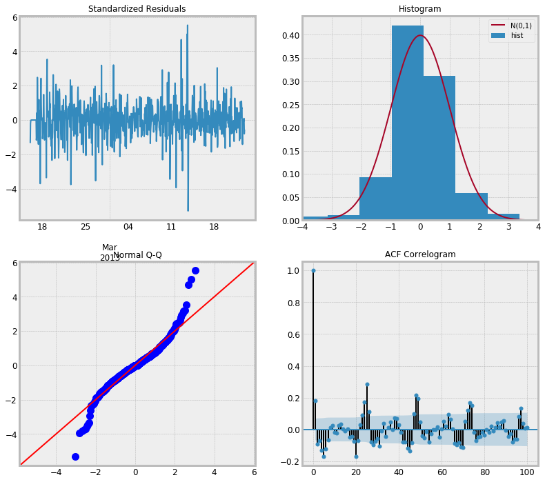


```python
predTemp, rmse = clfTemp.predict(start=test.index[0], end=test.index[-1], 
                                 timeVectorTest=test.t, trueValues=test.temp)
print('HW out-of-sample RMSE  = {} F'.format(round(rmse,2)))
```

    HW out-of-sample RMSE  = 2.26 F
    


```python
plt.plot(test.index, test.temp, label='Test', color="red")
plt.plot(test.index, predTemp, label='Holt-Winters')
plt.legend(loc='best')
plt.title("Temperature Forecast- 1 hr interval- 1 week ahead")
```


    Text(0.5,1,'Temperature Forecast- 1 hr interval- 1 week ahead')


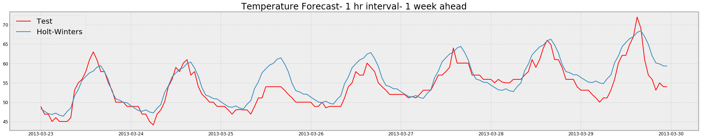


```python
plt.plot(test.index, test.temp, label='Test', color="red")
plt.plot(test.index, predTemp, label='Holt-Winters')
plt.legend(loc='best')
plt.title("Temperature Forecast - 15 min interval")
```


    Text(0.5,1,'Temperature Forecast - 15 min interval')


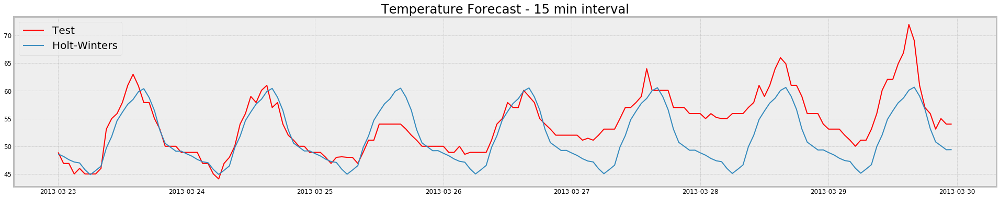


##### 3-1-2- SARIMA Model


```python
clfTempII = Forecaster(method='SARIMA', deseasonalize=True, degree=4, 
                         order=(1,1,1), seasonalOrder=(1,0,1,24))
```


```python
clfTempII.fit(y=train['temp'], timeVector=train.t) 
```


```python
clfTempII.summary()
```

    Model: SARIMA
    No. observation: 840
    Error STD: 1.625
    KS stat p_value: 0.0
    RMSE: 1.63
    


```python
predTempII, rmseII = clfTempII.predict(start=test.index[0], end=test.index[-1], 
                                 timeVectorTest=test.t, trueValues=test.temp)
print('ARIMA out-of-sample RMSE  = {} F'.format(round(rmseII,2)))
```

    ARIMA out-of-sample RMSE  = 4.38 F
    


```python
plt.plot(test.index, test.temp, label='Test', color="red")
plt.plot(test.index, predTempII, label='SARMIA')
plt.legend(loc='best')
plt.title("Temperature Forecast- 1 hr interval- 1 week ahead")
```


    Text(0.5,1,'Temperature Forecast- 1 hr interval- 1 week ahead')


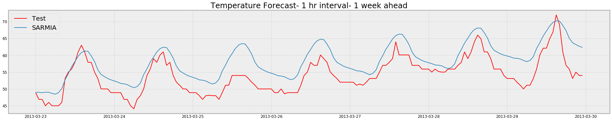


```python
clfTempII.plotDiagnostics(figsize=(12,12))
```


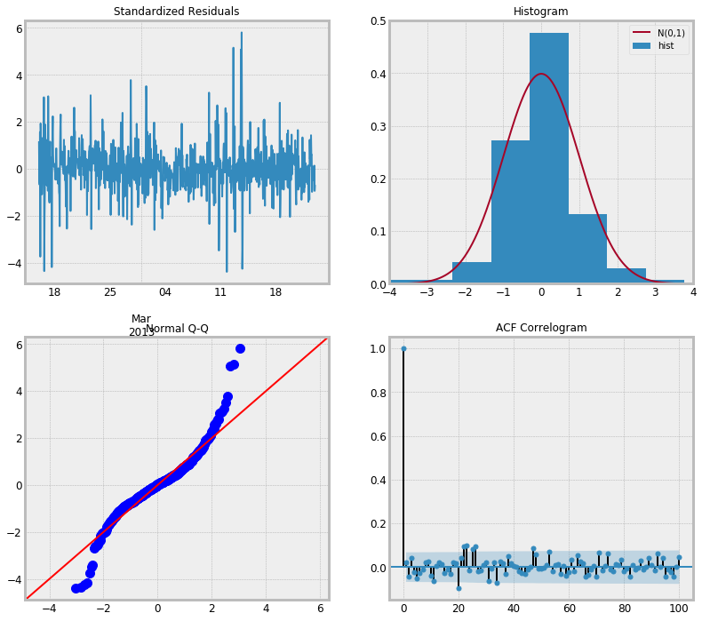


##### 3-1-3- Discussion

For temperature time series, both models are showing a promising results. The residuals in the HW model still show some significant correlations that makes the model less credible. The reason is that the HW model cannot capture multiple seasonality. However, the ability of the HW in longer term forecasting can be shown in the out-of-sample RMSE. There also possible to get even better results for ARIMA by finding the more optimum order. 


| metric| Holt-Winters | SARIMA |
|:-----------|------------:|:------------:|
| in-sample RMSE       |        1.8 |     1.63     |
| out-of-sample RMSE     |      2.26 |    4.38    |
| residual normality       |        yes |     yes     |
|residual autocorrelation         |          yes |      no      |


#### 3-2- Load
##### 3-2-1- Holt-Winters Model


```python
clfLoad = Forecaster(method="HW")
```


```python
clfLoad.fit(y=train['load'], xgen=train[['temp','dtemp','workDay']], seasonalPeriod=24*7) #weekly seasonality
```


```python
clfLoad.summary()
```

    Model: HW
    No. observation: 840
    Error STD: 3.99
    KS stat p_value: 0.366
    RMSE: 3.99
    


```python
clfLoad.plotDiagnostics(figsize=(12,12))
```


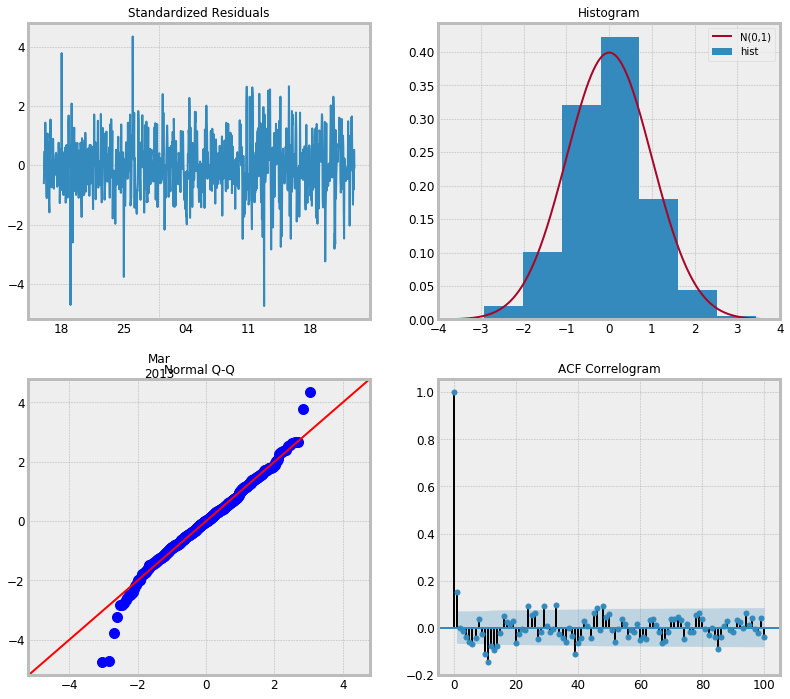


For the out-of-sample forecasting, the forcasted value of temperature is used:


```python
predTempTest = clfTemp.predict(start=test.index[0], end=test.index[-1], timeVectorTest=test.t)
xgenTest = pd.DataFrame(index=test.index, data={'temp':predTemp})
xgenTest['dtemp'] = abs(xgenTest['temp'] - meanTemp)
xgenTest['workDay'] = test['workDay']
xgenTest.head()
```


<div>
<style scoped>
    .dataframe tbody tr th:only-of-type {
        vertical-align: middle;
    }

    .dataframe tbody tr th {
        vertical-align: top;
    }

    .dataframe thead th {
        text-align: right;
    }
</style>
<table border="1" class="dataframe">
  <thead>
    <tr style="text-align: right;">
      <th></th>
      <th>temp</th>
      <th>dtemp</th>
      <th>workDay</th>
    </tr>
  </thead>
  <tbody>
    <tr>
      <th>2013-03-23 00:00:00</th>
      <td>48.319406</td>
      <td>8.680594</td>
      <td>0.0</td>
    </tr>
    <tr>
      <th>2013-03-23 01:00:00</th>
      <td>47.657493</td>
      <td>9.342507</td>
      <td>0.0</td>
    </tr>
    <tr>
      <th>2013-03-23 02:00:00</th>
      <td>47.022308</td>
      <td>9.977692</td>
      <td>0.0</td>
    </tr>
    <tr>
      <th>2013-03-23 03:00:00</th>
      <td>46.832352</td>
      <td>10.167648</td>
      <td>0.0</td>
    </tr>
    <tr>
      <th>2013-03-23 04:00:00</th>
      <td>47.170004</td>
      <td>9.829996</td>
      <td>0.0</td>
    </tr>
  </tbody>
</table>
</div>


```python
predLoad, rmseL = clfLoad.predict(start=test.index[0], end=test.index[-1], 
                                 xgenTest=xgenTest, trueValues=test.temp)
print('HW out-of-sample RMSE  = {} kwh'.format(round(rmseL,2)))
```

    HW out-of-sample RMSE  = 23.22 kwh
    


```python
plt.plot(test.index, test.load, label='Test', color="red")
plt.plot(pred.index, predLoad, label='Holt-Winters')
plt.legend(loc='best')
plt.title("Load Forecast - 1 hr interval- 1 week ahead")
```


    Text(0.5,1,'Load Forecast - 1 hr interval- 1 week ahead')


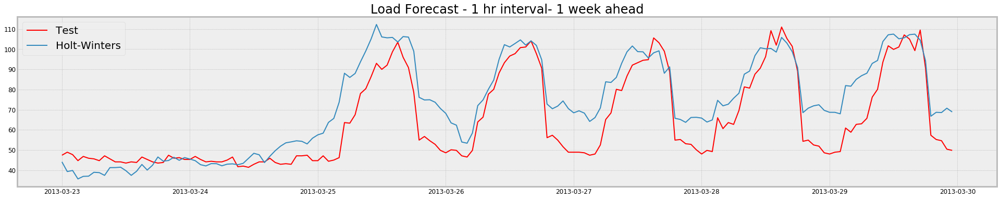


```python
plt.plot(test.index, test.load, label='Test', color="red")
plt.plot(pred.index, pred, label='Holt-Winters')
plt.legend(loc='best')
plt.title("Load Forecast - 15 min interval")
```


    Text(0.5,1,'Load Forecast - 15 min interval')


##### 3-2-2- SARIMA Model


```python
clfLoadII = Forecaster(method='SARIMA',  order=(1,0,1), seasonalOrder=(1,1,1,24))
```


```python
clfLoadII.fit(y=train['load'], timeVector=train.t) 
```


```python
clfLoadII.summary()
```

    Model: SARIMA
    No. observation: 840
    Error STD: 4.961
    KS stat p_value: 0.0
    RMSE: 4.96
    


```python
clfLoadII.plotDiagnostics(figsize=(12,12))
```


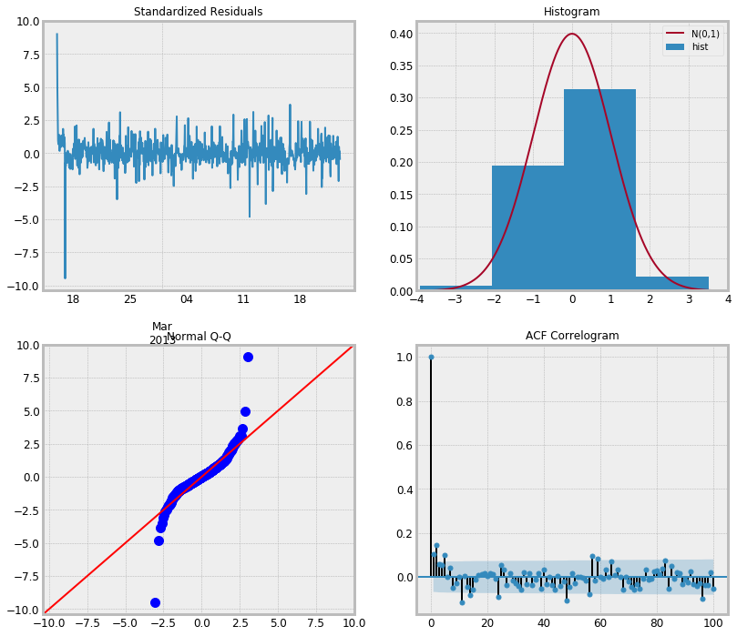


```python
predLoadII, rmseLII = clfLoadII.predict(start=test.index[0], end=test.index[-1], 
                                 xgenTest=xgenTest, trueValues=test.temp)
print('ARIMA out-of-sample RMSE  = {} kwh'.format(round(rmseLII,2)))
```

    ARIMA out-of-sample RMSE  = 10.82 kwh
    


```python
plt.plot(test.index, test.load, label='Test', color="red")
plt.plot(pred.index, predLoadII, label='SARIMA')
plt.legend(loc='best')
plt.title("Load Forecast - 1 hr interval- 1 week ahead")
```


    Text(0.5,1,'Load Forecast - 1 hr interval- 1 week ahead')


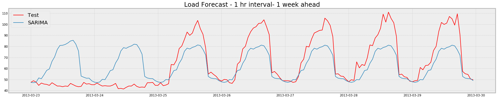


##### 3-2-3- Discussion

For load time series, HW shows a better performance but it should be noted that the ARIMA model for the load wasn't optimized to get the best orders. The ARIMA model is failed to capture the different patterns in weekends while HW model was able to capture that trend. 

| metric| Holt-Winters | SARIMA |
|:-----------|------------:|:------------:|
| in-sample RMSE       |        3.99 |     4.96     |
| out-of-sample RMSE     |      23.22 |    10.82    |
| residual normality       |        yes |     yes     |
|residual autocorrelation         |          no |      no      |

#### 3-4- Extra works that can be done!

For optimizing the application of ARIMA, we can call the `auto_arima` functions to check for different combination of the orders. The AIC factor can then be monitored to find the most suitable order for ARIMA.


```python
resTemp_ARIMA = pm.arima.auto_arima(train['load'], 
                           #exogenous=df.loc[::4, ['month']][:4000],
                           seasonal=True,
                           trace=True,
                           error_action='ignore',  
                           suppress_warnings=True, 
                           stepwise=True)
print(resTemp_ARIMA.aic())
```

    Fit ARIMA: order=(2, 1, 2) seasonal_order=(0, 0, 0, 1); AIC=5362.436, BIC=5390.829, Fit time=0.487 seconds
    Fit ARIMA: order=(0, 1, 0) seasonal_order=(0, 0, 0, 1); AIC=5441.519, BIC=5450.983, Fit time=0.038 seconds
    Fit ARIMA: order=(1, 1, 0) seasonal_order=(0, 0, 0, 1); AIC=5374.486, BIC=5388.682, Fit time=0.122 seconds
    Fit ARIMA: order=(0, 1, 1) seasonal_order=(0, 0, 0, 1); AIC=5392.132, BIC=5406.328, Fit time=0.152 seconds
    Fit ARIMA: order=(1, 1, 2) seasonal_order=(0, 0, 0, 1); AIC=5361.146, BIC=5384.807, Fit time=0.276 seconds
    Fit ARIMA: order=(1, 1, 1) seasonal_order=(0, 0, 0, 1); AIC=5360.335, BIC=5379.264, Fit time=0.200 seconds
    Fit ARIMA: order=(2, 1, 1) seasonal_order=(0, 0, 0, 1); AIC=5360.590, BIC=5384.251, Fit time=0.328 seconds
    Total fit time: 1.608 seconds
    5360.335417738653
    


```python
resTemp_ARIMA.get_params()
```


    {'callback': None,
     'disp': 0,
     'maxiter': 50,
     'method': None,
     'order': (1, 1, 1),
     'out_of_sample_size': 0,
     'scoring': 'mse',
     'scoring_args': {},
     'seasonal_order': (0, 0, 0, 1),
     'solver': 'lbfgs',
     'start_params': None,
     'suppress_warnings': True,
     'transparams': True,
     'trend': None,
     'with_intercept': True}


In the forecasting, the confidence interval of forcasted loads can reveale a lot ofinformation, especially for the decision-making process. 


```python
pred = results.get_prediction(start=test.index[0], end=test.index[-1], dynamic=True)
pred_ci = pred.conf_int()
```


```python
ax = test.temp.plot(label='observed', figsize=(30,6))
pred.predicted_mean.plot(ax=ax, label='One-step ahead Forecast', alpha=.7)

ax.fill_between(pred_ci.index,
                pred_ci.iloc[:, 0],
                pred_ci.iloc[:, 1], color='k', alpha=.2)

plt.legend()
```


    <matplotlib.legend.Legend at 0x1ca21a03c8>


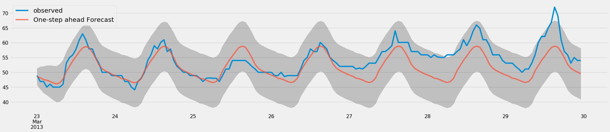


### 4- Conclusion

Before starting working on this project, I have done a short literature survey and I found out that the forecast electric load is an active research topic. Googling "electric load forecasting" and similar will yield quite a number of relevant hits, such as Cho et al. (2013, JASA). The most important point is to capture the overlapping seasonalities, as for example done by Taylor (2003, JORS). Hong & Fan (2016, IJF) performed a comprehensive review and listed all the relevant research studies on electric load forecasting.

In this practice, two model frameworks including Holt-Winters (aka Exponential Smoothing) and Seasonal ARIMA (aka SARIMA or SARIMAX) are applied to the electricity load and temperature time series for the purpose of short-term horizon forecasting. The load values showed moderately correlated with temperature. Therefore, a model is selected and fitted to the temperature first and the forecasted value of temperature are used as the input to the load forecasting models as an exogenous variable. 

Holt-Winters (HW) has only three smoothing parameters that makes it parsimonious and efficient. However, it is not able to capture multiple seasonality (in its original formulation). However, some researchers, e.g.  Taylor (2003, JORS), modified the HW that would be able to capture two seasonality. I couldn't find a proper library in Python for Holt-Winters with multiple-seasonality (there are libraries in R for that). SARIMA has more parameters and its parameters, especially the autoregressive coefficients, are more interpretable. However, ARIMA is computationally more intensive than HW and need more computational/memory resources. We can compare these models on the basis of their RMSE scores.

When evaluating and comparing statistical models fitted with different parameters, each can be ranked against one another based on how well it fits the data or its ability to accurately predict future data points. The AIC (Akaike Information Criterion) value can be used to fit several SARIMA models with different combinations of orders to find the optimum order associated with the lower AIC. The AIC measures how well a model fits the data while taking into account the overall complexity of the model as well.

For the temperature time series, the yearly seasonality is removed by fitting a polynomial to estimate the sinusoidal variation over the course of a year. For the load variables, the effect of exogenous variables is removed by fitting a linear regression to load vs the exogenous variables. Two linear regression models including OLS and GLS are introduced. The OLS is the ordinary linear regression model. The GLS assumes that autocorrelation exists in the regression residuals. While we already know that the load has strong autocorrelation, it seems that GLS is a more suitable method for this purpose.  

For model evaluation, it should be investigated to make sure that there is no remaining autocorrelation and seasonality in the model residuals. If we fit a model to the time series observation *$y_{t}$* it yields in-sample fits *$\tilde{y}_{t}$* . If the model fully captures existing seasonality patterns and autocorrelations, then the residuals *$y_{t}$*-*$\tilde{y}_{t}$* should not exhibit any remaining seasonality/autocorrelation. This can be checked by calling the `plotDiagnostics()` function of the `Forecaster` class. Our primary concern should be to ensure that the residuals of our model are uncorrelated and normally distributed with a zero mean. If a model does not satisfy these properties, it is a good indication that it can be further improved.

The following improvements can be done to the current practice to improve the load forecasting:
1. to increase the time period of the time series to at least 2 and at best to 5 years in order to let the models to capture the yearly seasonality and the effect of shifting holidays. 
2. to investigate other models and packages such as fbProphet to see if they can introduce more promising results.
3. to considere different outlier handling methods. In the forecasting context, removing outliers is tricky. In this case, we silently assumed that nothing like this will happen in the future. In practice, the confidence bands for the fitted forecast model will be narrower than they would have been if without removing the outlier. 


```python

```

